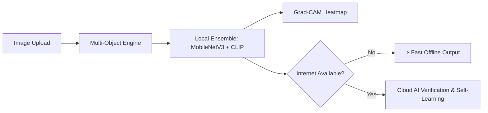

# ASTRA VISION 5.0 🎯
### AI-Powered Tactical Defence Reconnaissance & Intelligence

> **ASTRA 3-Day Build Challenge (2026–27)**  
> **Challenge 02: ASTRA VISION**  
> BMS Institute of Technology & Management &middot; Defence Technology, Software & AI/ML Club

---

## What is ASTRA VISION?

Imagine being at a border post or operating a drone during a mission. You spot something flying fast or moving through the dust. Is it a friendly aircraft or an enemy jet? Is it an F-22 or an F-35? 

In high-stress situations, making that call quickly is tough—especially when weather is bad, camouflage is in play, or you have **zero internet connection** in the field.

**ASTRA VISION 5.0** is an offline-first tactical reconnaissance tool that solves this. It scans military vehicles, identifies what they are in milliseconds, pulls up a complete technical dossier, and even shows you visually *why* it made that choice using heatmaps.

---

## ⚡ What It Can Do

- **Dual-Model Brain (90.38% Test Accuracy)**: Combines a lightweight **MobileNetV3-Small** CNN with **OpenAI CLIP (ViT-B/32)** in a 50/50 probability ensemble for fast, highly reliable classifications.
- **Smart Offline Mode (Latest V5)**: Senses internet connection instantly. If you lose network, it runs 100% locally on your laptop CPU with zero delay or failed calls.
- **Continuous Self-Learning (V5)**: When online, cloud AI (Gemini / Groq) acts as a verifier. If our local model ever makes a mistake, it learns from the correction, saves the new visual vector into memory (`online_memory.pt`), and gets it right next time.
- **Multi-Object Tracking**: Detects up to 10 vehicles in a single photo or lineup with interactive bounding boxes and target selection tabs.
- **Explainable AI (Grad-CAM)**: Shows a color heatmap over the image so operators can confirm the AI looked at key parts (like wings, rotors, or turrets) rather than background noise.
- **74+ Military Platform Knowledge Base**: Pulls instant intel dossiers—country, manufacturer, year introduced, fleet numbers, and weapons.
- **Batch Processing & History**: Drop an entire folder of photos to scan in bulk with CSV export, and access all past scans anytime in your history drawer.

---

## 🛠️ Tech Stack

- **Backend**: Python 3.12, FastAPI, Uvicorn
- **AI & Vision**: PyTorch, Torchvision, OpenAI CLIP (`transformers`), Pillow, NumPy
- **Cloud Verifier (Optional)**: Google Gemini 2.5 Flash, Groq LPU
- **Frontend**: Lightweight Tactical HUD (HTML5, CSS3, JavaScript)
- **Testing & Benchmarks**: PyTest, Scikit-Learn, Matplotlib

---

## 🧠 How It Works



1. **Upload**: Drop any photo (single target or multi-vehicle lineup).
2. **Crop & Isolate**: The engine finds distinct targets and generates bounding boxes.
3. **Local Identification**: MobileNetV3 and CLIP work together to classify the vehicle into one of 5 defense domains (Aircraft, Helicopter, Tank, Naval, Drone) and match it against 74+ known platforms.
4. **Explain**: Grad-CAM overlays a visual heatmap showing which physical contours drove the prediction.
5. **Route & Learn**: If offline, you get results instantly. If online, Gemini/Groq verifies the target and feeds corrections into persistent memory.

---

## 🚀 Quick Setup Guide

### 1. Clone & Enter Directory
```powershell
git clone https://github.com/punith-techub/ASTRA-VISION.git
cd ASTRA-VISION/CORE
```

### 2. Set Up Virtual Environment
```powershell
# Windows:
py -3.12 -m venv .venv
.\.venv\Scripts\Activate.ps1

# Linux / macOS:
python3 -m venv .venv
source .venv/bin/activate
```

### 3. Install Dependencies
```powershell
pip install -r requirements.txt
```

### 4. Configure API Keys *(Optional but Recommended)*
ASTRA VISION works completely fine offline without any keys! But adding free API keys unlocks cloud verification and continuous self-learning.

Create a `.env` file in the `CORE/` folder:
```env
# Google Gemini (Free tier available: https://aistudio.google.com/app/apikey)
GEMINI_API_KEY=your_gemini_key_here

# Groq Cloud (Free tier available: https://console.groq.com/keys)
GROQ_API_KEY=your_groq_key_here
```

### 5. Start the Application
```powershell
uvicorn app:app --reload --port 8000
```
Open **`http://localhost:8000`** in your browser.

---

## 📊 Performance & Validation

| Architecture | Accuracy | Macro F1 | ROC-AUC | Inference Speed |
|---|:---:|:---:|:---:|:---:|
| MobileNetV3-Small (Fine-Tuned) | 82.69% | 0.8170 | 0.9668 | Ultra Fast |
| OpenAI CLIP ViT-B/32 | 88.46% | 0.8864 | 0.9795 | Fast |
| **ASTRA VISION (Hybrid Ensemble)** | **90.38%** | **0.9044** | **0.9898** | **Real-Time** |

- **Automated Tests**: 14/14 PyTest unit and integration tests passing (`python -m pytest -v`).
- **Edge-Ready**: Runs cleanly on everyday consumer CPUs without requiring a dedicated GPU.

---

## ⚠️ Known Limitations

- **Optical Imagery Only**: Currently designed for standard daylight and monochrome photos, not raw FLIR thermal or radar (SAR) feeds.
- **Distant Targets**: Vehicles smaller than 32×32 pixels have limited visual features for fine-grained subtype identification.
- **Top-Down Overhead Angles**: Pure 90-degree satellite perspectives flatten vertical profiles, which can lower specific subtype confidence.

---

## 🔮 Future Improvements & Roadmap

Here is what we are building next to take ASTRA VISION even further:

### 1. 🔊 Sound-Based Prediction
- Predict and classify objects from sound alone.
- Listens to jet engine roars, rotor frequencies, and artillery blasts.
- Keeps working in heavy fog, sandstorms, and pitch darkness where cameras fail.

### 2. 📹 Live Camera Mode
- Live continuous recognition (similar to Gemini Live).
- Point your phone or drone camera directly at the sky or approaching vehicles.
- Shows real-time bounding boxes with instant tactical specs overlaid on screen.

### 3. 🔍 Text Feature Search
- Identify vehicles by typing observed physical features.
- Example: *"delta wing, twin fins, dual engine, refueling probe"*.
- The model parses the description and finds matching aircraft in seconds.

### 4. 📰 Contextual Flight & News Scraper
- Natural query recon: *"I saw a fighter jet today over my house in Bangalore"*.
- Automatically scrapes public flight radar feeds and defense news for local sorties (like HAL Tejas or Su-30MKI).
- Confirms what flew over your area along with detailed aircraft specs.

### 5. 🎯 YOLOv11-OBB & Edge Hardware
- Upgrade contour detection to Oriented Bounding Boxes (OBB) for tightly clustered aerial formations.
- Quantize neural weights to TensorRT / ONNX INT8 to run natively on Raspberry Pi 5 and NVIDIA Jetson boards.

### 6. 🌡️ Thermal + Optical Fusion
- Merge standard daylight camera feeds with thermal night-vision sensors for 24/7 all-weather surveillance.

---

## 📝 AI Usage Disclosure (Section 8.6)

```text
AI Tools Used:
- Antigravity, Codex

Used For:
- Code suggestions, API structure, debugging, and documentation cleanup.

Personally Implemented & Verified:
- Smart offline mode auto-router (omni_intelligence.py & app.js).
- 50/50 dual-model ensemble tuning (MobileNetV3 + CLIP).
- 74+ military platform specifications database (defense_knowledge.py).
- Multi-object bounding box extraction (multi_object_engine.py).
- PyTest automated test suite (14 passing tests).
- Tactical HUD interface (HTML/CSS/JS).
- Validation across real-world photos, ROC-AUC curves, and Grad-CAM heatmaps.
```

---

*ASTRA VISION 5.0 &middot; Built for the ASTRA 3-Day Build Challenge 2026–27 &middot; BMS Institute of Technology & Management*
