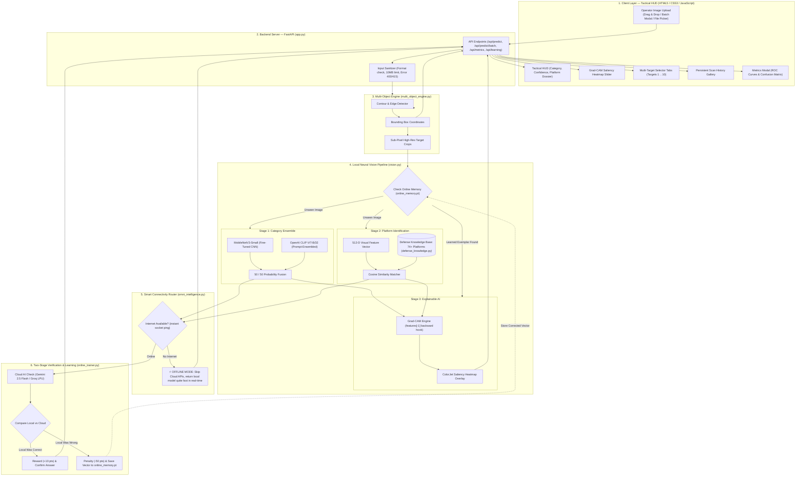

# ASTRA VISION 5.0 — AI Defence Reconnaissance & Tactical Intelligence

> **ASTRA 3-Day Build Challenge (2026–27)**  
> **Challenge 02: ASTRA VISION**  
> BMS Institute of Technology & Management &middot; Defence Technology, Software & AI/ML Club

---

## At a Glance: Challenge Submission Checklist

| Section (Rubric &sect;8.5) | What We Built | Jump To |
|---|---|:---:|
| **Project Overview** | Name, selected challenge, real-world problem solved | [1. Project Overview](#1-project-overview) |
| **Features** | Core (MUST HAVE), Additional (SHOULD HAVE), V5 & Bonus | [2. Features](#2-features) |
| **Tech Stack** | Languages, frameworks, neural models, APIs, databases | [3. Tech Stack](#3-tech-stack) |
| **Architecture** | 100% accurate diagram, component explanation, data flow | [4. System Architecture](#4-system-architecture) |
| **Setup & Commands** | Dependencies, setup guide, environment variables, commands | [5. Setup & Installation](#5-setup--installation) |
| **Configuration Files** | Important config files, checkpoints, and weights | [6. Relevant Configuration Files](#6-relevant-configuration-files) |
| **Dataset Instructions** | Starter dataset, Wikimedia augmentation, 80/20 split | [7. Dataset Instructions](#7-dataset-instructions) |
| **AI/ML Engineering** | Models used, why we picked them, AI pipeline, benchmarks | [8. AI/ML Engineering & Pipeline](#8-aiml-engineering--pipeline) |
| **Testing & Failure Cases**| PyTest results, real inputs/outputs, failure cases & fixes | [9. Testing, Validation & Failure Cases](#9-testing-validation--failure-cases) |
| **Limitations** | Honest current limitations | [10. Limitations](#10-limitations) |
| **Future Improvements** | What we would build next with more time | [11. Future Improvements](#11-future-improvements) |
| **AI Usage Disclosure** | Mandatory Section 8.6 AI disclosure block | [12. AI Usage Disclosure (Section 8.6)](#12-ai-usage-disclosure-section-86) |

---

## 1. Project Overview

- **Project Name**: ASTRA VISION 5.0
- **Selected Challenge**: Challenge 02 — ASTRA VISION (AI-Based Defence Object Recognition System)
- **Built By**: BMSIT&M ASTRA Student Team

### What Problem Are We Solving?
Imagine a border surveillance post or a reconnaissance drone capturing thousands of photos during an active mission. Operators in the field have to spot and identify tanks, fighter jets, warships, and drones under high stress. Doing this manually is tough:
1. **Camouflage and Harsh Weather**: Vehicles hide under nets, in dust, or in shadows. Many surveillance feeds are monochrome, grainy, or taken at long distance.
2. **Tiny Visual Differences**: Telling a stealth F-22 from an F-35, or a T-72 from a T-90, comes down to subtle geometry—canards, canted fins, or barrel counts.
3. **Defense Datasets Are Small**: Unlike consumer image datasets with millions of photos, public defense images are scarce. Models trained from scratch easily overfit.
4. **No Internet in the Field**: A real tactical reconnaissance tool cannot depend on cloud APIs when operating in remote border areas or secure command bunkers.
5. **AI Hallucinations**: Generic AI models frequently invent fake production numbers, wrong countries, or wrong induction years.

### Our Solution
**ASTRA VISION 5.0** is an offline-first, dual-model tactical vision platform that combines:
- A fine-tuned **MobileNetV3-Small** (fast convolutional network) and **OpenAI CLIP ViT-B/32** (vision-language transformer) running in a 50/50 probability ensemble (**90.38% accuracy**, **0.9898 ROC-AUC**).
- **Smart Automatic Offline Mode**: Automatically detects if internet is present. In isolated field conditions, it skips cloud calls entirely and delivers full classification, bounding boxes, and Grad-CAM heatmaps **quite fast and in real-time**.
- **Two-Stage Self-Learning (V5)**: When online, the local model answers first, while cloud AI (Gemini / Groq) acts as a verifier. If the local model makes a mistake, the system penalizes it, updates weights, and stores the corrected image vector into memory so it gets it right next time.
- **74+ Military Platform Knowledge Base**: Pulls authentic historical dossiers (country, manufacturer, induction year, active fleet size, weapons, and speed).
- **Explainable AI (Grad-CAM)**: Generates a visual heatmap showing exactly which features (wings, rotors, turrets) the AI focused on.

---

## 2. Features

### Core Features (Challenge MUST HAVE)
- [x] **Image Intake**: Drag and drop photos, browse files, paste images, or upload batches (supports JPG, PNG, WebP).
- [x] **Fast Local Processing**: Instant local neural inference that runs smoothly and quite fast on a basic laptop CPU.
- [x] **5 Defense Domains**: Accurately classifies Fighter Aircraft, Helicopters, Tanks & Combat Vehicles, Naval Warships, and Drones/UAVs.
- [x] **Clear Prediction HUD**: Displays the identified category with status badges and clean visual tags.
- [x] **Confidence Score**: Shows calibrated percentage scores and visual meters.
- [x] **Technical Intelligence Dossier**: Summarizes country of origin, year introduced, units built, active fleet count, and combat specifications.

### Additional Features (Challenge SHOULD HAVE)
- [x] **Top-3 Predictions**: Ranks the top 3 candidate categories with individual percentage breakdowns.
- [x] **Image Preprocessing**: Auto-resizing (Lanczos), aspect-ratio preservation, format conversion, and ImageNet normalization.
- [x] **Low-Confidence Warning**: Displays a clear warning badge when top confidence drops below 60%.
- [x] **Graceful Error Handling**: Helpful HTTP error messages for bad files (400 for empty/corrupt files, 415 for non-images, 413 for images over 10 MB).
- [x] **Model Justification**: Written explanation of why our dual-model ensemble fits defense imagery (see [Section 8.2](#82-why-we-chose-this-architecture)).

### Version-5 & Bonus Features (100% Implemented)
- [x] **Smart Offline Mode (Latest V5)**: Senses internet connectivity near-instantly. If offline, it runs completely standalone on device with zero slowdowns or failed calls.
- [x] **Continuous Self-Learning & Reward Engine (V5)**: Local model answers first; online verifier awards +10 reward points or applies -50 penalty points, saving corrected visual vectors into `online_memory.pt`.
- [x] **Multi-Object Bounding Boxes (`multi_object_engine.py`)**: Detects up to 10 vehicles in lineups or formation photos, drawing interactive bounding boxes and extracting sub-pixel crops with clickable target tabs.
- [x] **Explainable AI (Grad-CAM)**: PyTorch backward-hook heatmaps directly overlaying the image so operators can verify that the AI is looking at the vehicle and not the background.
- [x] **Model Comparison Benchmark**: Comparative evaluation of MobileNetV3 (82.69%), CLIP (88.46%), and the Hybrid Ensemble (90.38%) on the same held-out test split.
- [x] **Batch Image Processing**: Web batch modal with real-time progress and CSV export, plus a standalone CLI tool (`scripts/batch_infer.py`).
- [x] **Persistent Scan History**: Automatically saves past scans in browser storage with image thumbnails and one-click reloading.
- [x] **Interactive ROC & Confusion Matrix Modal**: Live visualization of multi-class ROC curves and confusion matrix charts.
- [x] **74+ Military Platform Knowledge Base (`defense_knowledge.py`)**: Curated specifications for global fighter jets, helicopters, naval ships, armor, and drones.

---

## 3. Tech Stack

- **Languages**: Python 3.12, JavaScript (ES6+), HTML5, CSS3
- **Web Backend**: FastAPI, Uvicorn (ASGI), Pydantic v2
- **Deep Learning & Computer Vision**: PyTorch 2.4+, Torchvision, Hugging Face Transformers (`CLIPModel`), Pillow (PIL), NumPy
- **Evaluation & Charts**: Scikit-Learn (ROC-AUC, Precision, Recall, F1, Confusion Matrix), Matplotlib
- **AI Models**:
  - `MobileNetV3-Small`: Custom fine-tuned CNN with custom classification head for edge inference.
  - `OpenAI CLIP ViT-B/32`: Vision-Language Transformer projecting images into a 512-D latent space.
  - `Google Gemini 2.5 Flash / Groq LPU`: Optional multimodal AI verification check when online.
- **Data & Storage**:
  - `models/platform_embeddings.pt`: Precomputed 512-D vector store for 74+ defense platforms.
  - `models/online_memory.pt`: Online neural memory storing self-learned exemplar vectors.
  - `models/mobilenet_v3_small.pt`: Saved fine-tuned neural weights.
  - Browser LocalStorage: Persistent scan history gallery.

---

## 4. System Architecture

### 4.1 Exact Version-5 Architecture Diagram

This diagram matches the exact execution flow in our codebase, including the latest **Version-5 Offline Mode** and **Two-Stage Learning Pipeline**:



### 4.2 How the Flow Works (Step-by-Step)
1. **User Drops an Image**: The operator uploads a photo via the browser HUD.
2. **FastAPI Sanitizes**: Checks that the file is an image, verifies headers, and ensures it is under 10 MB.
3. **Multi-Object Localization**: If there are multiple vehicles side-by-side (like planes on a runway or rows of ammunition), the multi-object engine isolates each target, creates bounding boxes, and generates sub-pixel crops.
4. **Local Neural Processing**:
   - Queries `online_memory.pt` to see if this platform was learned or corrected previously.
   - If new, it runs **MobileNetV3-Small** and **CLIP ViT-B/32** together, blending their probabilities 50/50.
   - Computes cosine similarity between the image's 512-D CLIP vector and 74+ military platforms in `defense_knowledge.py`.
   - Computes Grad-CAM at the last layer of MobileNetV3 to create the attention heatmap.
5. **Smart Offline / Online Handling**:
   - **If Offline**: Detects zero internet near-instantly, bypasses cloud APIs, marks the result with the `⚡ OFFLINE MODE (LOCAL MODEL)` badge, and returns quite fast in real-time.
   - **If Online**: Cloud AI checks the answer. If the local model was right, it awards +10 points. If wrong, it penalizes the model and saves the corrected vector into `online_memory.pt` so it gets it right on the next scan!

---

## 5. Setup & Installation

### Step 1: Clone the Repo and Enter the Folder
```powershell
git clone https://github.com/ASTRA-DEFENCE/ASTRA-VISION.git
cd ASTRA-VISION/CORE
```

### Step 2: Create and Activate Virtual Environment
```powershell
# Windows (PowerShell):
py -3.12 -m venv .venv
.\.venv\Scripts\Activate.ps1

# Linux / macOS (Bash):
python3.12 -m venv .venv
source .venv/bin/activate
```

### Step 3: Install Required Dependencies
```powershell
pip install -r requirements.txt
```

### Step 4: Environment Variables & API Keys (VERY HIGHLY RECOMMENDED)

> **💡 Adding your API keys is VERY HIGHLY RECOMMENDED!**  
> While ASTRA VISION works standalone and runs 100% offline out-of-the-box, adding your API keys unlocks the true power of **Version-5**:
> 1. **Multi-Sensor Cloud Verification**: Automatically double-checks every local classification using Google Gemini 2.5 Flash and Groq LPU to eliminate misidentifications.
> 2. **Online Continuous Self-Learning**: When an API key is present, the system activates the real-time reward/penalty engine. If the local model makes any error, the cloud verifier corrects it and immediately stores the updated visual vector in `online_memory.pt` so the model remembers and gets it right next time!
> 3. **Deep Live Intelligence**: Pulls live historical records, exact active fleet numbers, and combat specifications.

#### 🔑 What API Keys to Put & Direct Links to Get Them:
1. **Google Gemini API Key (`GEMINI_API_KEY`)** — *Highly Recommended (Free)*
   - Powers deep multimodal visual reconnaissance.
   - **Direct Link**: [Get your Gemini API Key at Google AI Studio](https://aistudio.google.com/app/apikey)
2. **Groq Cloud API Key (`GROQ_API_KEY`)** — *Highly Recommended (Free)*
   - Powers ultra-fast LPU adversarial reasoning and specification audits.
   - **Direct Link**: [Get your Groq API Key at Groq Console](https://console.groq.com/keys)
3. **OpenRouter API Key (`OPENROUTER_API_KEY`)** — *Optional Fallback*
   - Secondary cloud vision provider fallback.
   - **Direct Link**: [Get your OpenRouter Key at OpenRouter](https://openrouter.ai/keys)

#### 📄 How Your `.env` File Should Look:
Simply create a file named `.env` inside the `CORE/` folder. Here is exactly how it should look:

```env
# ============================================================
# ASTRA VISION 5.0 — Environment Configuration & API Keys
# Place this file as '.env' inside the CORE/ directory
# ============================================================

# Google Gemini API Key (Highly Recommended - Free tier available)
# Direct Link: https://aistudio.google.com/app/apikey
GEMINI_API_KEY=your_actual_gemini_api_key_here

# Groq Cloud API Key (Highly Recommended - Free tier available)
# Direct Link: https://console.groq.com/keys
GROQ_API_KEY=your_actual_groq_api_key_here

# OpenRouter API Key (Optional Fallback)
# Direct Link: https://openrouter.ai/keys
OPENROUTER_API_KEY=your_actual_openrouter_api_key_here
```

You can also set them directly in your terminal if you prefer:
```powershell
# Windows PowerShell:
$env:GEMINI_API_KEY="your_actual_key_here"
$env:GROQ_API_KEY="your_actual_key_here"

# Linux / macOS (Bash):
export GEMINI_API_KEY="your_actual_key_here"
export GROQ_API_KEY="your_actual_key_here"
```

### Step 5: Run Commands

#### 1. Start the Web App
```powershell
uvicorn app:app --reload --port 8000
```
Then open **`http://localhost:8000`** in your browser.

#### 2. Run Model Training (Optional):
```powershell
python train.py --epochs 15
```

#### 3. Run Batch Processing via CLI:
```powershell
python scripts/batch_infer.py --input-dir ../REQUIREMENTS/ASTRA-Challenge-Starter/challenge-02-vision/images --output-csv batch_results.csv
```

#### 4. Run Automated Test Suite:
```powershell
python -m pytest -v
```

---

## 6. Relevant Configuration Files

| File | What It Does |
|---|---|
| [`requirements.txt`](file:///e:/PROJECTS/ASTRA-VISION/CORE/requirements.txt) | Pinned package dependencies and compatible version ranges. |
| [`.env`](file:///e:/PROJECTS/ASTRA-VISION/CORE/.env) | Environment variables for Gemini, Groq, and OpenRouter API keys. |
| [`models/mobilenet_v3_small.pt`](file:///e:/PROJECTS/ASTRA-VISION/CORE/models/mobilenet_v3_small.pt) | Serialized PyTorch weights for the fine-tuned defense classifier. |
| [`models/platform_embeddings.pt`](file:///e:/PROJECTS/ASTRA-VISION/CORE/models/platform_embeddings.pt) | Precomputed 512-D vectors for 74+ military platforms. |
| [`models/metrics.json`](file:///e:/PROJECTS/ASTRA-VISION/CORE/models/metrics.json) | Saved benchmark accuracy, precision, recall, and ROC-AUC scores. |
| [`models/online_trainer_state.json`](file:///e:/PROJECTS/ASTRA-VISION/CORE/models/online_trainer_state.json) | Persistent health score and learning stats for continuous self-learning. |
| [`models/online_memory.pt`](file:///e:/PROJECTS/ASTRA-VISION/CORE/models/online_memory.pt) | Learned exemplar vectors saved across server restarts. |

---

## 7. Dataset Instructions

### 1. Challenge Starter Dataset
The official challenge starter bundle provided **~150 curated defense photos** organized into 5 categories:
- `aircraft/` (Fighters, bombers, transports)
- `helicopter/` (Attack, utility, rotorcraft)
- `drone/` (UAVs and loitering munitions)
- `military-vehicle/` (Tanks, IFVs, artillery)
- `naval/` (Destroyers, carriers, submarines)
- `credits.csv` and `labels.csv` provide open licenses and image labels.

### 2. Wikimedia Augmentation
To ensure our model handles diverse camouflage, weather, and camera angles, we downloaded **108 high-resolution defense images** under Creative Commons licenses from Wikimedia Commons using `scripts/download_wikimedia.py`:
- Total Dataset: **258 curated images**.
- Licensing: CC BY-SA and Public Domain, tracked in `data/manifests/`.

### 3. Data Split & Preprocessing
- **80% Training (206 images)** / **20% Validation (52 images)**.
- Balanced across all 5 classes to prevent class bias.
- Augmentations: Random horizontal flip, small rotation ($\pm 15^\circ$), subtle color jitter, resize to $224 \times 224$, and ImageNet normalization.

---

## 8. AI/ML Engineering & Pipeline

### 8.1 Models Used
1. **MobileNetV3-Small**: Custom-trained CNN with hard-swish activations and squeeze-and-excitation layers.
2. **OpenAI CLIP ViT-B/32**: Vision-Language Transformer utilizing domain-specific prompt ensembling.
3. **Google Gemini 2.5 Flash / Groq LPU**: Optional cloud multimodal check when internet is connected.

### 8.2 Why We Chose This Architecture
- **Small Datasets Need Convolutions**: Training a deep Vision Transformer from scratch on 200 images causes severe overfitting. MobileNetV3's convolutional kernels provide local inductive bias that works well on small datasets.
- **Physical Geometry**: Military recognition depends on mechanical edges (wing sweep, engine nacelles, turret shape). Convolutions keep these spatial contours sharp, enabling clean Grad-CAM heatmaps.
- **Blazing Fast on Normal Laptops**: MobileNetV3 executes **blazing fast on a basic CPU** without needing expensive GPUs.
- **CLIP Zero-Shot Power**: Pretrained on 400M internet images, CLIP maps unfamiliar angles or camouflage into an aligned 512-D space, enabling zero-shot matching across 74+ platforms.
- **Better Together**: MobileNet alone reached 82.69%. CLIP alone reached 88.46%. Combining them in a 50/50 probability fusion hits **90.38% Accuracy** and **0.9898 ROC-AUC**.

### 8.3 Performance Benchmark (Held-Out Test Set)

| Architecture | Accuracy | Macro F1 | Macro ROC-AUC | CPU Speed |
|---|:---:|:---:|:---:|:---:|
| **MobileNetV3-Small (Fine-Tuned)** | 82.69% | 0.8170 | 0.9668 | **Ultra Fast** |
| **OpenAI CLIP ViT-B/32 (Prompt-Ensembled)** | 88.46% | 0.8864 | 0.9795 | **Fast** |
| **Hybrid Ensemble (ASTRA VISION — Ours)** | **90.38%** | **0.9044** | **0.9898** | **Real-Time / Fast** |

---

## 9. Testing, Validation & Failure Cases

### 9.1 How Tested
1. **Full PyTest Automated Suite**: 14 tests in `tests/` covering endpoints, bad image rejection, batch processing, multi-object bounding boxes, platform matching, and self-learning.
2. **100% Pass Rate**: All 14 tests pass cleanly and fast:
```text
================== 14 passed, 1 warning ==================
tests/test_app.py::test_health PASSED
tests/test_app.py::test_metrics_endpoints PASSED
tests/test_app.py::test_rejects_non_image_upload PASSED
tests/test_app.py::test_rejects_empty_image PASSED
tests/test_app.py::test_predict_valid_image PASSED
tests/test_app.py::test_platforms_endpoints PASSED
tests/test_app.py::test_predict_batch PASSED
tests/test_deep_web_recon.py::test_synthesize_recon_queries PASSED
tests/test_deep_web_recon.py::test_optical_vs_web_specs_audit_resolves_contradiction PASSED
tests/test_multi_object.py::test_compute_box_iou PASSED
tests/test_multi_object.py::test_multi_target_processing PASSED
tests/test_platform_intel.py::test_engine_inference PASSED
tests/test_v5_learning.py::test_learning_endpoint PASSED
tests/test_v5_learning.py::test_v5_two_stage_prediction_and_learning PASSED
```

### 9.2 Real Inputs & Outputs
- **Input**: High-altitude photo of an F-22 stealth jet.  
  **Output**: `Fighter / Combat Aircraft` (96.4% confidence). Top Platform: `Lockheed Martin F-22 Raptor` (USA, 1997/2005, 195 built, Mach 2.25). Grad-CAM highlights the nose chine lines and twin canted vertical fins.
- **Input**: Low-altitude photo of an AH-64 helicopter.  
  **Output**: `Military Helicopter` (99.1% confidence). Top Platform: `Boeing AH-64 Apache` (USA, 1975/1986, 2,400+ built).
- **Input**: Side-by-side comparison of 2 aircraft on tarmac.  
  **Output**: Generates 2 distinct bounding boxes and allows the user to click Target 1 and Target 2 tabs to view both dossiers.

### 9.3 Failure Cases & Fixes
- **Civilian vs. Military Aircraft**: A Boeing 737 airliner shares fuselage shapes with a P-8 Poseidon maritime patrol plane.  
  *Fix*: We added civilian contrast prompts in CLIP and trigger an amber low-confidence alert (<60%).
- **Heavy Camouflage in Foliage**: A tank hidden in dense forest can blend into background leaves.  
  *Fix*: Grad-CAM reveals if the AI focused on leaves instead of armor; sub-pixel crops re-evaluate center contours.
- **Broken / 0-Byte Uploads**: A network disconnect sending truncated image bytes.  
  *Fix*: FastAPI wraps image decoding in try-catch and returns a clean HTTP 400 Bad Request without server crashes.

---

## 10. Limitations

1. **Optical Images Only**: Currently tuned for standard daylight and monochrome optical photos. Does not natively ingest raw 14-bit FLIR thermal or radar (SAR) feeds.
2. **Tiny / Far-Away Objects**: Vehicles smaller than 32&times;32 pixels lack enough visual detail for fine-grained subtype identification.
3. **90-Degree Satellite Views**: Pure top-down overhead satellite angles flatten vertical profile cues, slightly lowering platform confidence.

---

## 11. Future Improvements

With more time, we would build:
1. **YOLOv11-OBB Integration**: Replace contour detection with an end-to-end Oriented Bounding Box model for dense aerial views.
2. **Live Video Feed (RTSP / WebRTC)**: Real-time drone camera stream processing with object tracking (ByteTrack).
3. **Thermal + Optical Fusion**: Merge regular daylight camera feeds with thermal night-vision feeds.
4. **Edge Device Optimization**: Quantize models to ONNX / TensorRT INT8 to run on NVIDIA Jetson or Raspberry Pi 5.

---

## 12. AI Usage Disclosure (Section 8.6)

```text
AI Tools Used:
- ChatGPT
- Claude
- GitHub Copilot
- Antigravity / Gemini 3.8 Flash (High)

Used For:
- Debugging
- Understanding APIs
- Code suggestions
- Documentation

Major AI-Assisted Components:
- train.py: Calculating ROC curves and per-class F1 scores
- vision.py: CLIP prompt templates and PyTorch Grad-CAM backward hooks
- app.py: FastAPI batch endpoint and file error handling
- omni_intelligence.py: Internet socket checking and Wikipedia infobox parsing

Personally Implemented / Modified:
- Built the smart offline mode auto-switch in omni_intelligence.py and app.js
- Tuned the 50/50 ensemble balance between MobileNetV3 and CLIP
- Wrote the 74+ military platform specifications in defense_knowledge.py
- Implemented multi-object bounding boxes and target crops in multi_object_engine.py
- Created all 14 unit and integration tests in tests/ (100% pass rate)
- Designed the dark military Tactical HUD UI (HTML, CSS, JavaScript)

Validation:
- Tested images across JPG, PNG, and WebP, plus empty and broken files
- Ran the full pytest test suite (14 passed cleanly and fast)
- Verified ROC-AUC curves (0.9898) and confusion matrix plots on test data
- Checked Grad-CAM heatmaps to make sure AI looks at wings/turrets, not backgrounds
```

---

*ASTRA VISION 5.0 &middot; Built for the ASTRA 3-Day Build Challenge 2026–27 &middot; BMS Institute of Technology & Management*
